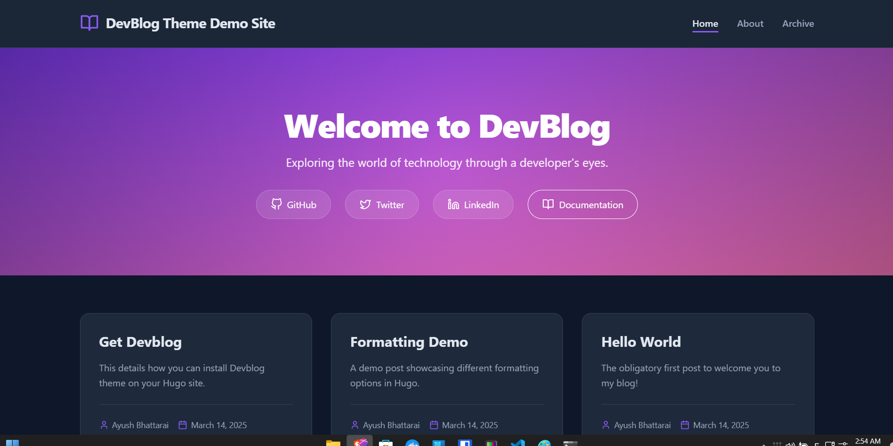

# DevBlog - A Modern Hugo Theme for Developers

[](https://gohugo.io/)
[](LICENSE)

DevBlog is a responsive, clean, and feature-rich Hugo theme specifically designed for developers who want to share their knowledge through blogging. With its dark mode aesthetic and developer-focused features, it's the perfect platform for technical content.



## Features

- 🌙 **Dark Mode Design** - Modern dark theme designed for optimal code readability
- 📱 **Fully Responsive** - Looks great on all devices, from phones to desktops
- ⚡ **Fast & Optimized** - Minimal assets with optimized loading
- 📄 **Clean Article Design** - Focused reading experience for technical content
- 🤖 **Automatic Reading Time** - Automatically calculates reading time for articles
- 👤 **Support for Both Single Author & Team Blogs** - Flexible author layouts
- 📂 **Organized Archive** - Posts organized by year with search functionality
- 🔍 **SEO Friendly** - Structured metadata for better search engine visibility
- 🔗 **Social Media Integration** - Easy linking to your social profiles
- 🎨 **Customizable Components** - Multiple hero styles, about pages, and more

## Installation

### Creating a New Site (For beginners)

If you're starting from scratch, follow these steps:

```bash
# Install Hugo (if not already installed)
# macOS: brew install hugo
# Windows: choco install hugo-extended
# For other platforms, see https://gohugo.io/installation/

# Create a new Hugo site
hugo new site my-blog
cd my-blog

# Initialize Git repository
git init

# Add DevBlog theme as a Git submodule
git submodule add https://github.com/aaxyat/hugo-devblog.git themes/devblog

# Create basic configuration
cp themes/devblog/exampleSite/hugo.toml .
```

### Method 1: As a Git Submodule (For existing Hugo sites)

```bash
# Navigate to your existing Hugo site
cd your-hugo-site

# Initialize Git repository (if not already done)
git init

# Add DevBlog theme as a Git submodule
git submodule add https://github.com/aaxyat/hugo-devblog.git themes/devblog
```

### Method 2: Direct Download

1. Download the [latest release](https://github.com/aaxyat/hugo-devblog/releases)
2. Extract it to your Hugo site's `themes` directory
3. Rename the extracted folder to `devblog`

## Getting Started

1. In your Hugo site's root directory, edit your `hugo.toml` (formerly `config.toml`):

```toml
baseURL = "https://example.com/"
languageCode = "en-us"
title = "Your Blog Title"
theme = "devblog"

# Theme parameters
[params]
  description = "A blog about coding, web development, and technology."
  
  [params.social]
    github = "yourusername"
    twitter = "yourusername"
    linkedin = "yourusername"
```

2. Create your first blog post:

```bash
hugo new posts/my-first-post.md
```

3. Edit the post's front matter:

```yaml
---
title: "My First Post"
date: 2023-07-15
author: "Your Name"
description: "Introduction to my blog"
tags: ["introduction", "first-post"]
categories: ["general"]
---

Hello world! This is my first post using the DevBlog theme...
```

4. Start the Hugo development server:

```bash
hugo server -D
```

Now you can view your site at http://localhost:1313/

## Documentation

Comprehensive documentation is available in the [wiki.md](wiki.md) file included with the theme.

### Key Customization Areas

- **Hero Section** - Multiple styles including default, minimal, and image background
- **About Page** - Supports both single author and team layouts
- **Archive Page** - Standard and compact styles with optional search
- **Footer** - Highly customizable with multiple sections

## Credits

- [Hugo](https://gohugo.io/) - The world's fastest framework for building websites
- [Feather Icons](https://feathericons.com/) - Simply beautiful open source icons

## License

DevBlog is licensed under the [MIT License](LICENSE).

## Support

If you enjoy this theme, please consider:

- ⭐ Starring the GitHub repo
- 🐛 Creating an issue if you find a bug
- 🔀 Submitting a pull request with any improvements
- 📢 Sharing the theme with others

## Changelog

### v1.0.0
- Initial release with all core features

## Contributors

- [Ayush Bhattarai](https://github.com/aaxyat) - Creator and maintainer
